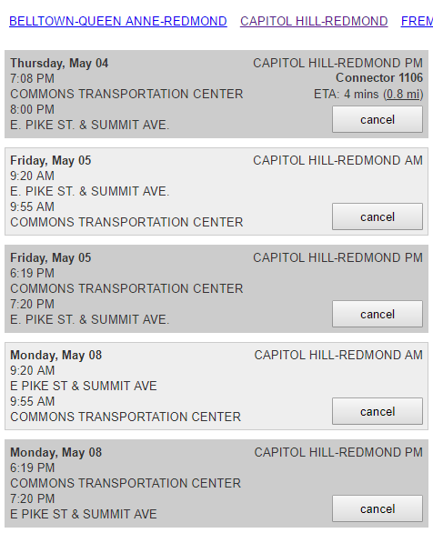
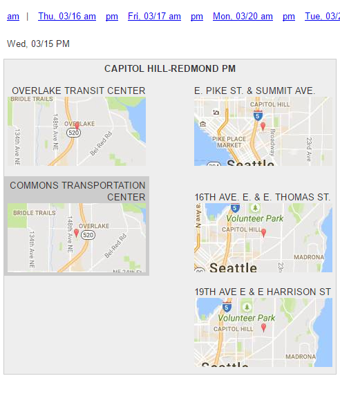
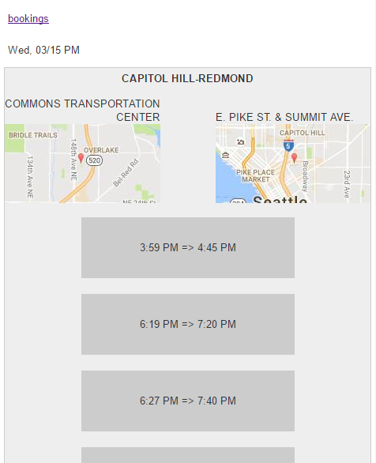

# QuickShuttle: Microsoft Connector access in four taps

usable alternative to Microsoft Merge or Connectorride.com

mobile-friendly, usable front-end for Connector shuttle service including

* map preview of stops
* quick access to Connector slots and times that are still available
* ICS calendar feed for integration into Outlook, Google Calendar, Apple Calendar
* preview of shuttle location when approaching booked stop

 Step 1: see all bookings | Step 2: select stops  | Step 3: select time
:------------------------:|:---------------------:|:---------------------:
     |       | 
